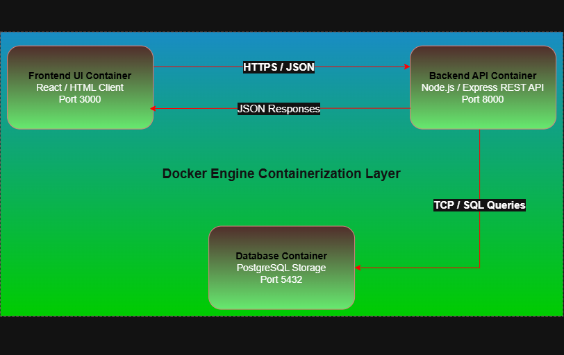

# Eventify — Campus Event Management Portal

## Project Overview
Eventify is a streamlined web application designed for university environments to manage campus events, ticket bookings, and organizer workflows. It provides a clean, responsive interface for students to discover events and for event organizers to manage capacity and entry passes efficiently.

## Problem Statement
Traditional campus event coordination relies on fragmented Google forms, manual email confirmation, and slow ticket verification at venue gates, causing long queues and poor student engagement.

## Target User Personas
* **The Student:** Goal to browse upcoming events, reserve entry tickets, and access digital QR passes in one place.
* **The Event Organizer / Faculty:** Goal to create event listings, set capacity caps, and monitor real-time attendee registrations.

## Vision Statement
To deliver a lightweight, high-speed campus event portal that streamlines ticket pass generation and event discovery through standardized containerized delivery.

## Key Features & Goals
* **Role-Based Authentication:** Secure login for Students and Organizers.
* **Event Discovery Feed:** Category filters and search functionality for upcoming campus activities.
* **Ticket & Pass Hub:** Real-time seat tracking and digital pass generation.
* **Containerized Deployment:** Dockerized local development environment for instant setup.

## Success Metrics
* **Performance:** Sub-150ms API response times for event feeds.
* **Usability:** Ticket booking completed in under 3 clicks.
* **Reliability:** 100% environment parity using Docker.

## Assumptions & Constraints
* **Assumptions:** Users access the platform via standard WebGL/HTML5 desktop browsers.
* **Constraints:** Storage capped by container volume allocations; basic REST architecture.

## UI/UX Figma Wireframes
[Click here to view Interactive Figma Prototype](https://www.figma.com/design/ZT3MxxnWpjrVg8UOVY7WgU/Untitled?node-id=0-1&t=dMOinXLPymqkQPdZ-1)

## MoSCoW Prioritization

| Category | Features Included |
| :--- | :--- |
| **Must Have** | Role-Based Authentication, Event Feed, Event Detail Page, Digital Ticket Pass Generator, Dockerized Setup. |
| **Should Have** | Category Filtering, Real-time Seat Counter, Organizer Dashboard, Pass Management View. |
| **Could Have** | Dark Mode Toggle, Event Search Bar, Toast Notifications on Booking. |
| **Won't Have (Review 1)** | Real-time Live Chat, Payment Gateway, Push Notifications. |

---

## Workload Division

| PERSON A: DevOps, Architecture & Backend | PERSON B: UI/UX & Agile Docs |
| :--- | :--- |
| • Project Repo & Docker Configuration | • Vision Document & README.md |
| • Backend Server Code (Node.js/Express) | • 25 GitHub User Story Issues |
| • Architecture Diagram (Draw.io Landscape) | • 6 Figma Wireframe Screens |
| • Execution Screenshots (Terminal/Browser) | • MoSCoW Prioritization Table |

---

## Dev Setup & Local Development Strategy

### Branching Strategy (GitHub Flow)
We strictly adhere to GitHub Flow:
* `main`: Production-ready, stable codebase.
* `feature/*`: Dedicated branches created for isolated tasks (e.g., `feature/docker-setup`).

### Quick Start – Local Development
1. Clone repository: `git clone https://github.com/PyCodeWizard-SujatraBiswas/Eventify.git`
2. Run Docker containers: `docker-compose up --build`
3. Access UI: `http://localhost:3000`

## Software Design
Eventify follows a modular Layered (MVC) architectural pattern built with Node.js/Express and fully containerized using Docker. The frontend interface communicates via RESTful API routes, keeping business logic cleanly separated from presentation handlers to ensure low coupling and high maintainability.

